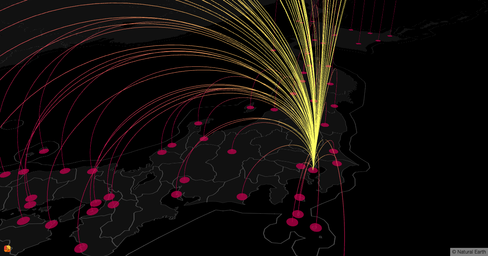

# DECK.GL Arch Example



## Usage

To install dependencies:

```bash
npm install
# or
yarn
```

Commands:
* `npm start` is the development target, to serves the app and hot reload.
* `npm run build` is the production target, to create the final bundle and write to disk.
* `npm run screenshot` is the command to take a screenshot.
